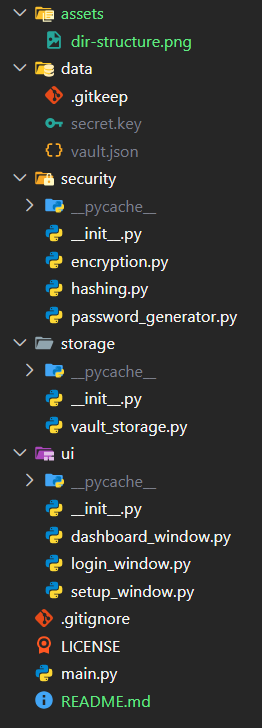

<h1 align="center">
  
</h1>

<p align="center">
<i>Store securely. Access instantly. Protect confidently.</i>
</p>

---

**VaultX v2** is a **secure desktop password manager built with Python and Tkinter**, designed to safely store, encrypt, and manage credentials through a clean, modular, and intuitive graphical interface.

The project focuses on **desktop application development, GUI programming, software architecture, cryptography, secure password storage, hashing, encryption, CRUD operations, modular design, and practical cybersecurity concepts**, while following clean coding practices and conventional Git workflows.

Unlike browser-based password managers, VaultX v2 stores all credentials **locally** in an encrypted vault, giving users complete control over their data.

> **Note:** VaultX v2 is a personal learning project focused on exploring secure software development, GUI application architecture, and modern Python programming practices.

---

<p align="center">
  
  
  
</p>

<p align="center">
  
  
  
</p>

<p align="center">
  
  
  
</p>

<p align="center">
  
</p>

# Features

1. ### Authentication

- Create a secure vault
- Master password authentication
- Secure master password hashing
- Automatic first-time setup experience

2. ### Credential Management

- Add new credentials
- View stored credentials
- Edit existing credentials
- Delete credentials
- Reveal or hide individual passwords
- Encrypted password storage
- Local JSON-based vault

3. ### Security

- Master password hashing with **SHA256**
- Credential encryption using **Fernet**
- No plaintext passwords stored inside the vault
- Local-first architecture
- Encrypted storage for every saved credential

4. ### Password Generator

- Cryptographically secure password generation
- Built using Python's **secrets** module
- One-click password generation while adding or editing credentials
- Strong passwords containing letters, digits, and special characters

5. ### User Experience

- Clean Tkinter desktop interface
- Modular project architecture
- Responsive dashboard workflow
- Separate setup, login, and dashboard interfaces
- Designed with maintainability and scalability in mind

## Project Architecture

<p align="center">
  
</p>

The project follows a **modular architecture**, where each component is responsible for a single part of the application. This separation of concerns makes the project easier to maintain, test, and extend with new features.

```text
VaultX-v2/
│
├── assets/
│
├── data/
│   ├── .gitkeep
│   ├── vault.json
│   └── secret.key
│
├── security/
│   ├── __init__.py
│   ├── encryption.py
│   ├── hashing.py
│   └── password_generator.py
│
├── storage/
│   ├── __init__.py
│   └── vault_storage.py
│
├── ui/
│   ├── __init__.py
│   ├── dashboard_window.py
│   ├── login_window.py
│   └── setup_window.py
│
├── .gitignore
├── LICENSE
├── main.py
└── README.md
```

# Application Workflow

```text
                User
                  │
                  ▼
          Login / Setup Window
                  │
                  ▼
        Master Password Validation
                  │
        ┌─────────┴─────────┐
        │                   │
        ▼                   ▼
 Create New Vault   Unlock Existing Vault
        │                   │
        └─────────┬─────────┘
                  ▼
              Dashboard
                  │
        ┌─────────┼──────────┐
        │         │          │
        ▼         ▼          ▼
    Add/Edit     View      Delete
   Credential Credentials Credential
        │
        ▼
 Encrypt Password (Fernet)
        │
        ▼
 Encrypted JSON Storage
```

# Tech Stack

<div align="center">

| Component | Technology |
|------------|------------|
| Language | Python 3 |
| GUI Framework | Tkinter |
| Password Hashing | SHA256 |
| Encryption | cryptography (Fernet) |
| Password Generation | secrets |
| Data Storage | JSON |
| Version Control | Git + GitHub |

</div>


# Build & Run

### Requirements

- Python **3.10** or later
- Git (for cloning the repository)

### Clone Repository

```bash
git clone https://github.com/abhi-saurav-saroya/VaultX-v2.git
cd VaultX-v2
```

### Install Dependencies

```bash
pip install -r requirements.txt
```

---

### Run the Application

```bash
python main.py
```

# Usage

1. Launch VaultX v2.
2. If no vault exists, create a new master password.
3. Unlock your vault using the master password.
4. Add new credentials.
5. Generate strong passwords whenever required.
6. View stored credentials.
7. Reveal or hide passwords individually.
8. Edit credentials whenever necessary.
9. Delete credentials you no longer need.


<p align="center">
  
</p>

## Contributing

Contributions, ideas, and suggestions are always welcome!

If you'd like to improve VaultX v2, feel free to:

- Fork the repository
- Create a feature branch
- Commit your changes using Conventional Commits
- Open a Pull Request

Every contribution, no matter how small, helps make the project better.

## License

This project is licensed under the **MIT License**.

Feel free to use, modify, and distribute this project in accordance with the license terms.

## Future Roadmap

- Search credentials
- Copy username & password to clipboard
- Password strength indicator
- Change master password
- Auto-lock after inactivity
- Export & Import vault
- Dark mode
- Settings page
- Cloud synchronization


## Security Notice

VaultX v2 is a learning project that implements modern security concepts such as **bcrypt password hashing**, **Fernet encryption**, and **cryptographically secure password generation**.

While it follows good development and security practices, it **has not been professionally audited** and should not yet be relied upon for storing highly sensitive or production-critical credentials.

<p align="center">
  
</p>

<div align="center">

### **VaultX v2**

### Built to learn. Designed to secure. Engineered one credential at a time.

*"Security isn't a feature, it's the foundation."*

<br>

⭐ **If you found this project helpful, consider giving it a star!**

It helps support the project and motivates future development.


**Made with ❤️, Python, and a passion for secure software development.**

**© 2026 VaultX v2 • Open Source • MIT License**

</div>